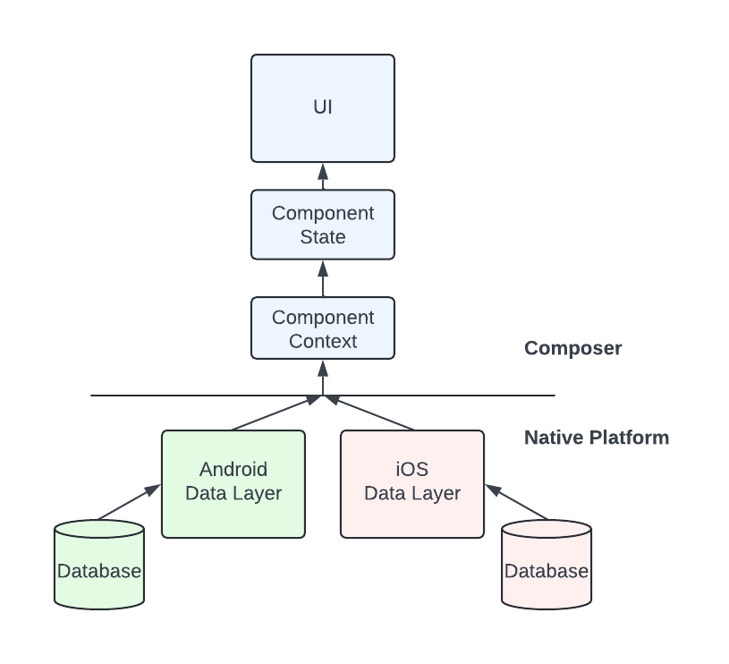
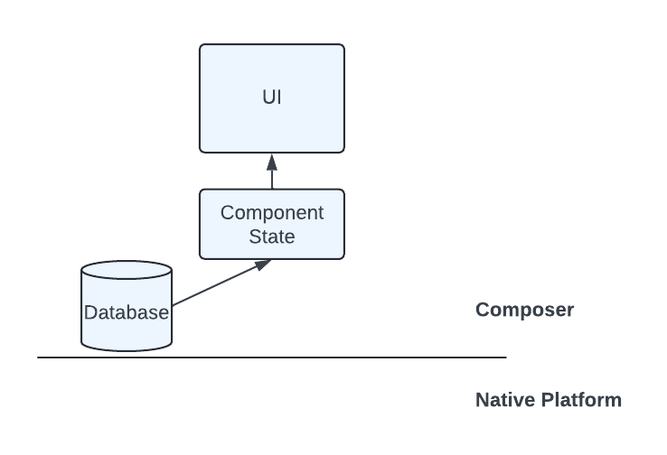
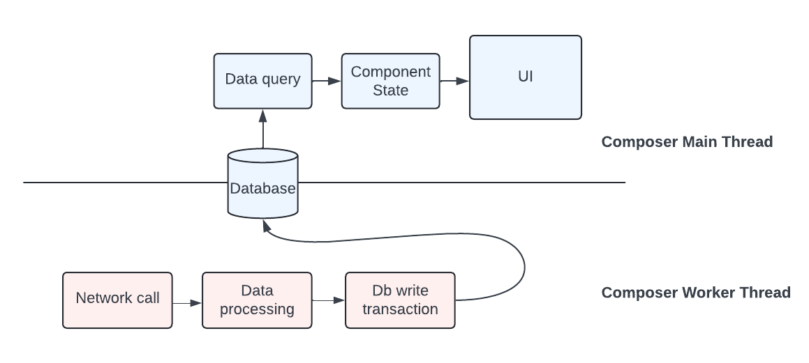

# Full stack Valdi

Valdi is often used to build cross-platform UI, achieving the same look-and-feel across Android and iOS, built from a common codebase and using advanced capabilities like Hot Reload. But client-side features are more than just their UI, requiring data and other services and APIs to build something useful.

This document outlines the two main models to building a Valdi feature end-to-end: A "bridged" approach, where data and services are provided via common APIs with per-platform implementations, and a "full-stack" approach, where a majority of feature code (including its data/service layer) are written almost purely in Valdi.


## Bridged Architecture

A "bridged" feature architecture is one in which its UI is built using cross-platform Valdi, while its data and services are provided via a "bridge" from Android and iOS. The bridge is a set of data objects and APIs defined using Valdi's [native annotations](./native-annotations.md), passed from Android/iOS to Valdi via a [Component Context](./native-context.md). Android/iOS implementations populate these data objects or implement these interfaces, and pass them in when [instantiating their Component](./native-bindings.md#using-the-context-most-common-recommended).




### When to use Bridging
Bridging is a good solution for features that have existing complex data and APIs in Android/iOS that power the UI experience. Additionally, sometimes a feature needs to make heavy use of OS-specific APIs, perhaps to access physical resources like Bluetooth or camera frames that aren't otherwise directly available in Valdi.

If the data and services are already available in Android/iOS, but with needs that aren't very complicated, consider adopting a [Full-Stack Valdi](#full-stack-valdi) architecture which will simplify ongoing development with key benefits discussed in detail below.

### Shortcomings of Bridging
A bridge-based approach for Valdi development has a few shortcomings. First and foremost, each bridged api must be implemented in each supported platform (eg Android/iOS). This adds development overhead, first by requiring more code be written in more languages, but also modifying this code requires each platform to be built entirely, instead of leveraging hot reload or, at worst, recompiling Valdi modules.

Another challenge with bridged APIs is that sometimes the platform-specific implementations are not the same. This forces a developer to write a "least common denominator" api, one that can be handled by each platform, or alternatively accept deviations across platforms. These least common denominator apis may incur performance penalties, for example bulk-loading a data set to create a common representation, which could otherwise be queried on-demand.

Lastly, while Valdi's bridging APIs are quite efficient, passing data from platform to Valdi will always incur some amount of overhead. Keeping data purely within Valdi can eliminate this concern.


## Full-Stack Valdi
Full-Stack Valdi is an alternative to a bridge-based feature architecture where the majority of a feature's data and services are built directly in Valdi. We'll outline how to build a scalable feature with a distinct data and UI layers, but the key patterns can work with other background services as well (perhaps processing video frames or running AI inference tasks). A full-stack architecture does not necessarily mean there is no platform-specific bridging, but that the majority of the feature is built purely within Valdi.



There are a few key components that work together for a highly performant full-stack design:
* [RxJs](https://rxjs.dev/) for reactive programming
* [Worker Services](./advanced-worker-service.md) for running expensive computation on a background thread


### Reactive Data for Reactive UI

Valdi's UI is designed to be _reactive_. This means that state changes in a component's data model automatically trigger re-renderings of the UI, which keep your UI up-to-date with its underlying state seamlessly. 

Reactive UI works especially well with a [Unidirectional Data Flow](https://medium.com/@lizdenhup/understanding-unidirectional-data-flow-in-react-3e3524c09d8e) architecture powered by a reactive data store. Similar to reactive UI, a reactive data store automatically updates computed state whenever its underlying data changes. This is generally done by observing data changes and mapping those changes to the desired state.

### Reactive Stores and Worker Threads
Valdi guarantees that all I/O operations (namely network calls and disk reads/writes) run asynchronously and will not block Typescript threads. As a result, a feature can be built with medium complexity while still running in one thread. But as the complexity grows, it's helpful to have a guarantee that data processing and other expensive non-UI operations cannot block UI operations.

For complex features built with Full-Stack Valdi, we leverage an additional property of our data store: multi-threaded observability. This means that changes to the data store can occur in one thread, while notifications of those changes and subsequent reads from the store may occur in another. This means we can issue our sql write transactions in a worker thread, and on our main thread we observe changes and read data via reactive queries.



We can set up a service to run as a worker thread as follows:
```typescript

  export interface IFriendStoriesDataSyncer {
    sync(trigger: StoriesRequest.Trigger): Promise<MetaSyncToken>;
  }

  @workerService(WorkerServiceExecutors.CONTENT, module)
export class FriendStoriesDataSyncerWorker extends WorkerServiceEntryPoint<
  IFriendStoriesDataSyncer,
  [INetworkingClient, IContentRequestInfoProvider | undefined, INativeStoriesResponseProcessor]
> {
  start(
    networkingClient: INetworkingClient,
    contentRequestInfoProvider: IContentRequestInfoProvider | undefined,
    nativeStoriesResponseProcessor: INativeStoriesResponseProcessor,
  ): IWorkerService<IFriendStoriesDataSyncer> {
    const service = new FriendStoriesDataSyncer(
      networkingClient,
      new ContentRequestInfoProvider(contentRequestInfoProvider),
      nativeStoriesResponseProcessor,
    );

    return {
      api: service,
      dispose: () => {
        service.dispose();
      },
    };
  }
}
```

We can run this worker service from our feature's data layer:
```typescript
  private async useFriendStoryDataSyncer(
    fn: (friendStoryDataSyncer: IFriendStoriesDataSyncer) => Promise<void>,
  ): Promise<void> {
    const worker: IWorkerServiceClient<IFriendStoriesDataSyncer> = useOrStartWorkerService(
      FriendStoriesDataSyncerWorker,
      [this.networkClient, this.contentRequestInfoProvider, this.nativeStoriesResponseProcessor],
    );
    try {
      await fn(worker.api);
    } finally {
      worker.dispose();
    }
  }

  async syncFriendStories(trigger: StoriesRequest.Trigger): Promise<void> {
    await this.useFriendStoryDataSyncer(async friendStoryDataSyncer => {
      try {
        console.log(`${TAG}: syncing friend stories`);
        await friendStoryDataSyncer.sync(trigger);
      } catch (e) {
        console.error(`${TAG}: failed to fetch friend stories. err: ${e}`);
        throw e;
      } finally {
        runtime.performGC();
      }
    });
  }
```

Which can be called from our UI:
```typescript
  private onPullToRefresh = async (): Promise<void> => {
    this.setState({ isLoading: true });
    await this.contentDataService.syncFriendStories(StoriesRequest.Trigger.TRIGGER_PULL_TO_REFRESH);
    this.resetScroll(false);
  };
````

### Debugging Full-Stack Valdi

Valdi has a great local development experience for building UI, and these capabilities extend to Full-Stack Valdi as well.

Valdi's support for [tracing](./performance-tracing.md) works well with worker threads, giving visibility into the operations and their performance while iterating.

