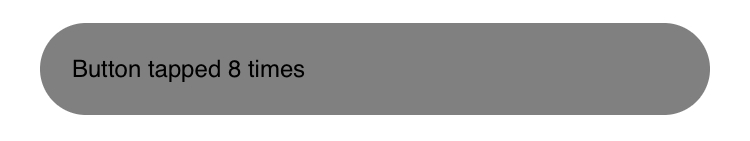

# Component Events

To support the ability to listen to and respond to native-side and user interactions as well as a component's lifecycle, Valdi emit events that can be listened to inside pure TypeScript. These events can be handled by registering a listener function via the proper callback.

## View and Layout Events

In Valdi the `<view>` or `<layout>` elements exposes some lifecycle events such as `onLayout`, `onViewPortChanged`, `onLayoutComplete`, `onVisible`, `onMeasure`, etc., which can be called with a `Frame` that describes the actual components.

These view and layout based events will also receive information regarding its position and dimensions with the defined interface of an `ElementFrame`.

These `Frame` or `Size` type events usually have the following:

```js
interface ElementFrame extends Point, Size {
  x: number;
  y: number;
  width: number;
  height: number;
}
```

> [!NOTE]  
> In Valdi, positional data such as a view's (`x`, `y`) locations refer to an offset from the top left relative to its parent view. Whereas (`absoluteX`, `absoluteY`) refer to its offset from the root Valdi view.

Valdi's geometry based events will implement the following interface(s):

```js
interface Point {
  x: number;
  y: number;
}

interface Size {
  width: number; // floating point representation of size, point based
  height: number;
}

interface Vector {
  dx: number; // floating point representation of velocity
  dy: number;
}
```

## Touch and Gesture Events

For touches and gestures, the `<view>` exposes interaction based events and callbacks such as `on[Touch/Tap/Drag/Scroll/Pinch]`. Each of those callbacks will contain information about the `TouchEvent` whenever the corresponding gesture is performed on a view.

A `TouchEvent` contains the following information for all other gesture event types to extend from.

```js
interface TouchEvent {
  x: number;
  y: number;
  absoluteX: number; // X position from within the root element
  absoluteY: number; // Y position from within the root element
  pointerCount: number; // count of active pointers
  pointerLocations: Pointer[]; // all pointer locations, which contain individual point data
}
```

> [!NOTE]  
> For a comprehensive list of all gesture events, refer to [`valdi_tsx/src/GestureEvents.d.ts`](../../src/valdi_modules/src/valdi/valdi_tsx/src/GestureEvents.d.ts)

For advanced usage of gestures and managing their events, refer to the [Touches and Gestures](./core-touches.md) page.

## Text Editing Events

For events based on text editing, Valdi exposes `onChange`, `onWillChange`, `onSelectionChange`, and so on which that receive `EditTextEvent` as part of the callback.

An `EditTextEvent` has the following:

```js
interface EditTextEvent {
  text: string; // string value of any text that's entered into a text field, ignoring any styling and annotations from attributed text
  selectionStart: number; // beginning of selection
  selectionEnd: number; // end of selection, can be equal to selectionStart
}
```

For more information regarding text and text editing, refer to the [Text and Label](./core-text.md) page.

## Callbacks

Within Valdi, we translate TypeScript-based callbacks so that our native runtime and native code can execute the calls directly. Due to the TypeScript context system, we enforce that all callbacks must properly refer to the correct value of `this`, and so we expect all callbacks to be passed in via TypeScript lambda functions, which do not create modify any references to `this`.

Furthermore, due to how rendering is performed, where `onRender` or an future render functions are called, we recreate all references and variables within the render function. Developers should avoid creating inline functions, and instead use [`createReusableCallback`](../../src/valdi_modules/src/valdi/valdi_core/src/utils/Callback.ts) to ensure functions references are correct.

## Example

We can create a custom button which increments a counter when it's tapped as follow:

```tsx
interface MyButtonState {
  counter: number;
}
export class MyButton extends StatefulComponent<object, MyButtonState> {
  state = {
    counter: 0,
  };
  onRender() {
    const buttonText = `Button tapped ${this.state.counter} times`;
    // Render our button, with a label
    // which displays how many times the button was tapped
    <view
      margin={20}
      backgroundColor='gray'
      borderRadius='50%'
      padding={16}
      onTap={this.buttonTapped} // Register a callback for when the view is tapped
    >
      <label value={buttonText} />
    </view>;
  }
  // Notice that we declared the function as a lambda instead of a method.
  // This allows to ensure the onTap callback is not created at every render.
  private buttonTapped = () => {
    // Increment our counter in our state
    // which will trigger a new render and update the UI
    this.setState({ counter: this.state.counter + 1 });
  };
}
```

and voila:

```tsx
export class HelloWorld extends Component {
  onRender() {
    <MyButton />;
  }
}
```


