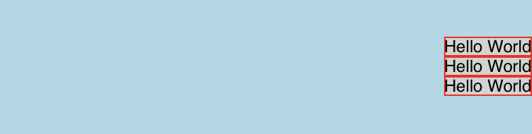

# FlexBox Layout

## What is FlexBox Layout

Valdi uses [FlexBox](https://developer.mozilla.org/en-US/docs/Web/CSS/CSS_flexible_box_layout/Basic_concepts_of_flexbox) for layout. This should be familiar if you have done any web development.

You can find examples and documentation on the different attributes for laying out views on the screen on the following references:
- https://css-tricks.com/snippets/css/a-guide-to-flexbox/
- https://jonibologna.com/flexbox-cheatsheet

You can also practice on a real-time flexbox sandbox here:
- https://yogalayout.com/playground/

## FlexBox attributes in 30 seconds

> [!Note]
>**Keep the following in mind:**
>- `main axis`: in **row mode** it is the **horizontal axis**, in **column mode** it is the **vertical axis**
>- `cross axis`: in **row mode** it is the **vertical axis**, in **column mode** it is the **horizontal axis**

**FlexBox mainly uses the following attributes:**
- `flexDirection` used to describe if children should be arranged in rows or columns
- `justifyContent` used to describe alignment of items along the **main axis**
- `alignItems` used to describe alignment of items along the **cross axis**

**Less often you might want to use other secondary attributes:**
- `flexShrink` used to describe how the parent container should constrain item size
- `flexGrow` used to describe how item should occupy empty space in parent container
- `flexWrap` used to describe how wrapping is done

## FlexBox examples in 30 seconds

#### Example 1 Requirements

- A row of elements ➜ `flexDirection=row`
- Horizontally centered ➜ `justifyContent=center` (in row mode, main axis is horizontal)
- Vertically aligned to the bottom ➜ `alignItems=flex-end` (in row mode, cross axis is vertical)

go! 🎉

```tsx
export class HelloWorld extends Component {
  onRender() {
    <view
      flexDirection='row' // Row mode
      justifyContent='center' // Main axis centered (row mode: main axis is horizontal)
      alignItems='flex-end' // Cross axis toward end (row mode: cross axis is vertical)
      backgroundColor='lightblue'
      height={100}
    >
      {this.onRenderItems()}
    </view>;
  }
  onRenderItems() {
    for (let i = 0; i < 3; i++) {
      <image src='https://placedog.net/500' height={64} width={64} border='1 solid red' />;
    }
  }
}
```


#### Example 2 Requirements

- A column of elements ➜ `flexDirection=column`
- Vertically centered ➜ `justifyContent=center` (in column mode, main axis is vertical)
- Horizontally aligned to the right ➜ `alignItems=flex-end` (in column mode, cross axis is horizontal)

go! 🎉

```tsx
export class HelloWorld extends Component {
  onRender() {
    <view
      flexDirection='column' // column mode
      justifyContent='center' // Main axis centered (column mode: main axis is vertical)
      alignItems='flex-end' // Cross axis toward end (column mode: cross axis is horizontal)
      backgroundColor='lightblue'
      height={100}
    >
      {this.onRenderItems()}
    </view>;
  }
  onRenderItems() {
    for (let i = 0; i < 3; i++) {
      <label value='Hello World' border='1 solid red' backgroundColor='lightgrey' font={TextStyleFont.BODY}/>;
    }
  }
}
```



## Things to keep in mind

- `flexDirection` will impact every other flex attribute's behavior!
- `justifyContent`/`alignItems` are equivalent, but apply to the main-axis/cross-axis
- `alignSelf` is equivalent to `alignItems`, but apply only on one child


### Default behaviors

- `flexDirection` = "column" (top to bottom)
- `justifyContent` = "flex-start" (start of the main-axis)
- `alignItems` = "stretch" (take all space in cross-axis)
- `flexShrink` = "0" (do not shrink content size when constrained by parent size)
- `flexGrow` = "0" (do not grow content size when space is available in parent)
- `flexWrap` = "no-wrap" (do not wrap around the cross-axis)
