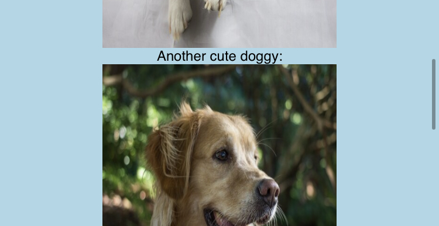
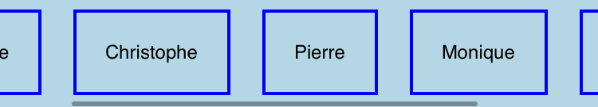

# The `<scroll>`

## Introduction

Valdi provides a very easy way to implement a scrollable container through the `<scroll>` element in TSX.

If any of the children of this `<scroll>` element are laid out outside the bounds of the `<scroll>` element itself, the region will be scrollable. The content size for the `<scroll>` element is determined automatically by the runtime.

In most cases, this actually removes the need for a ListView equivalent of the native code, you simply add components inside of a scroll view instead!

## Simple Example

Let's implement a simple list of scrollable elements as follow:

```tsx
import { Component } from 'valdi_core/src/Component';

export class HelloWorld extends Component {
  onRender() {
    <scroll height={200} width='100%' backgroundColor='lightblue'>
      <view flexDirection='column' width='100%' alignItems='center'>
        <label value='Cute doggy:' />
        <image src='https://placedog.net/600' width={200} height={200} />
        <label value='Another cute doggy:' />
        <image src='https://placedog.net/500' width={200} height={200} />
        <label value="This time it's cute kitty:" />
        <image src='http://placecats.com/200/200' width={200} height={200} />
      </view>
    </scroll>;
  }
}
```



## Dynamic list of data (ListView equivalent)

This is great and all, but what if I have dynamic data!?
Well unlike native view patterns, in this case we simply need to loop over our data and render on element for each!
Valdi will know which one to display and which one to hide.

```tsx
import { Component } from 'valdi_core/src/Component';

// Some arbitrary list of elements we want to render, this data can be dynamic!
const items = ['Sophie', 'Christophe', 'Pierre', 'Monique', 'Jean-Claude'];

// Let's make a scrollable component
export class HelloWorld extends Component {
  onRender() {
    // Make a scroll view
    <view>
      <scroll width='100%' horizontal={true} backgroundColor='lightblue'>
        {items.forEach(item => {
          // For Each Item: Render one box with a label for each item in our list
          <view padding={10} border='2 solid blue' margin={10}>
            <label value={item} margin={10} adjustsFontSizeToFitWidth={true} />
          </view>;
        })}
      </scroll>
    </view>;
  }
}
```



The page will be made automatically scrollable whenever the content of `scroll` is bigger than the `scroll` element itself.

## Horizontal vs Vertical

A `<scroll />` can be displayed in horizontal mode by setting the `horizontal` attribute to `true`:

```tsx
onRender() {
  <scroll horizontal={true}>
    {items.forEach(() => {
      // add children
    })}
  </scroll>
}
```

## What about UITableView, UICollectionView, ListView or RecyclerView?

Those view classes are designed to efficiently implement a scrollable region on iOS and Android. Valdi has its own internal mechanism to make scrolling efficient without forcing users to adhere to a strict API.

In Valdi you don't have to think or deal with view recycling/re-use, the framework handles everything under the hood for you and it has similar performance to those view classes.

Using [flexbox properties](./core-flexbox.md) to layout your child views provides a simple and flexible way to provide a large list of scrollable components. For this reason, Valdi does not currently provide APIs for those view classes.

## Complete API Reference

For a comprehensive list of all properties and methods available on `<scroll>` elements, including scroll events, bounce behavior, viewport extensions, and programmatic scroll control, see the [API Reference](../api/api-reference-elements.md#scrollview).
