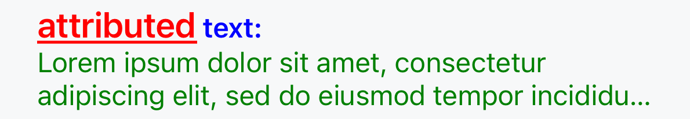

# The `<label>` and Text

## Components

For text rendering and editing, we have a few core components able to display text and to accept end user input.

For translations, look at [Localization](./advanced-localization.md). 

#### Label
The `<label />` is the default for displaying text - this component supports displaying either a single line or multiple lines of text. It offers various styling options, including adjustments to the font, text color, alignment, and autoscaling.

#### TextField
The `<textfield />` is the default for editing text in one line - this component only supports editable text in a single line. This and textview support options like placeholder, text editing configurations, and keyboard and selection settings.

#### TextView
The `<textview />` is the component for editing text in multiline.
## Common Properties

#### value
This is how we set the text to be displayed, and can accept a string (directly or through localization) or [`AttributedText`](../../src/valdi_modules/src/valdi/valdi_tsx/src/AttributedText.d.ts).

#### Styling

Text components can be directly styled via `style`, or via specific text attributes:

- [Common attributes for all text][../../src/valdi_modules/src/valdi/valdi_tsx/src/NativeTemplateElements.d.ts#L1385]
- [Label attributes][../../src/valdi_modules/src/valdi/valdi_tsx/src/NativeTemplateElements.d.ts#L1438]
- [Text editor attributes][../../src/valdi_modules/src/valdi/valdi_tsx/src/NativeTemplateElements.d.ts#L1013]

### EditTextEvents

Text editing is done via a callback on `onChange`, and associated callbacks `onWillChange`, `onSelectionChange`, and so on. [These receive an EditTextEvent](./core-events.md#Events).

## Attributed Text 

Attributed text allows end users to style individual pieces of text within a larger paragraph/block, building complex attributed text objects by supplying different styling attributes. This does not support Android-like spannables merging multiple spans, instead an user must individually construct all chunks with the applicable styles applied.

This uses [`AttributedTextBuilder`](../../src/valdi_modules/src/valdi/valdi_core/src/utils/AttributedTextBuilder.ts) to build a set of text chunks with the following methods:

`AttributedTextBuilder` - base constructor method, exposes an `AttributedTextBuilder` instance for the following operations

`append`: `(text: string, attributes: AttributedTextAttributes) => AttributedTextBuilder` - standard text chunk addition method, which supports appending a text string and its styles simultaneously 

`appendText`: `(text: string) => AttributedTextBuilder` - adds only text, keeping the styling from the base component

`appendStyled`: `(styled: AttributedTextStyled) => AttributedTextBuilder` - functionally the same as `append`, with `{ content: string (text), attributes: AttributedTextStyle }` as a single parameter

`withStyle`: `(attributes: AttributedTextAttributes, callback: (textBuilder: AttributedTextBuilder) => void) => AttributedTextBuilder` - decorator function for all nested calls to `AttributedTextBuilder` within a callback, to apply the same styles within

`build`: `() => AttributedText` - must be called to create an `AttributedText` to pass into `value`

Attributed text can take the following [`AttributedTextAttributes`](../../src/valdi_modules/src/valdi/valdi_tsx/src/AttributedText.d.ts#L6) options per chunk:
```
font?: string;
color?: string;
textDecoration?: LabelTextDecoration;
onTap?: AttributedTextOnTap;
onLayout?: AttributedTextOnLayout; // receives the full size of the attributed text chunk
outlineColor?: string; // note that both width and color are required for outline
outlineWidth?: number;
```

### Examples

```js
import { AttributedTextAttributes } from 'valdi_tsx/src/AttributedText';
import { AttributedTextBuilder } from 'valdi_core/src/utils/AttributedTextBuilder';
import { TextStyleFont } from 'widgets/src/styles/TextStyleFont';
import { Spacing } from 'widgets/src/styles/spacing';

const attributedTextBuilder = new AttributedTextBuilder();
attributedTextBuilder.pushFont(TextStyleFont.BODY);

const title1: AttributedTextAttributes = {
  color: 'red',
  textDecoration: 'underline',
  font: TextStyleFont.TITLE_4,
};
const title2: AttributedTextAttributes = {
  color: 'blue',
  font: TextStyleFont.BODY_EMPHASIS,
};
const body: AttributedTextAttributes = {
  color: 'green',
};

attributedTextBuilder.append('attributed', title1);
attributedTextBuilder.append(' text:', title2);
attributedTextBuilder.append('\n');

attributedTextBuilder.append(loremIpsum, body);

attributedTextBuilder.pop();
```
```tsx
<layout padding={Spacing.XS}>
  <label value={attributedTextBuilder.build()} numberOfLines={3} />
</layout>;
```


## Complete API Reference

For a comprehensive list of all properties and methods available on `<label>`, `<textfield>`, and `<textview>` elements, including all text styling, keyboard configuration, callbacks, and editing behaviors, see the [API Reference](../api/api-reference-elements.md):
- [Label API](../api/api-reference-elements.md#label)
- [TextField API](../api/api-reference-elements.md#textfield)
- [TextView API](../api/api-reference-elements.md#textview)
