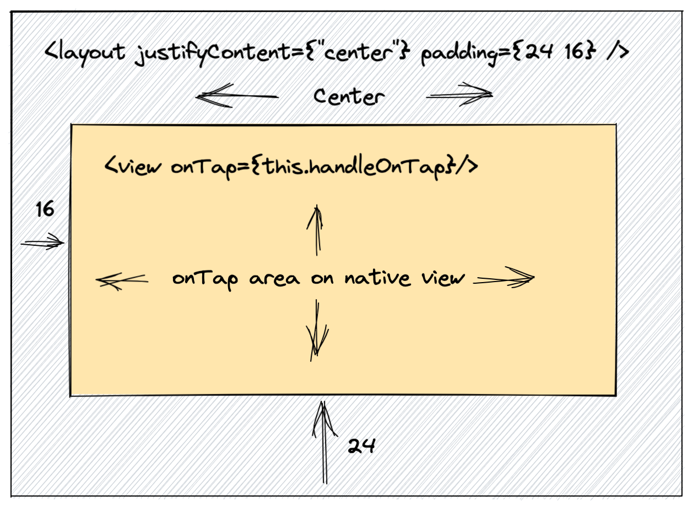

# The `<layout>` and `<view>`

## Understanding `<layout>` and `<view>`

Layout and Views are the basic building blocks of any Valdi feature.

`<layout>` is an invisible rectangular container that is used to configure the layout of the elements within it. It does not emit a resulting platform view (UIView/android.View) instance.

`<view>` is the main element for building a UI which emits an actual native platform view (`UIView`/`android.View`) instance that can be rendered.

Here is a quick comparison of their feature set.

**What are they:**
- `<layout>` is a simple invisible rectangular container
- `<view>` is a simple rendered rectangular container

**What they can do:**
- a `<layout>` can only apply the flex layout
- a `<view>` can: render a background color, render a border, receive tap events

**What do they do:**
- each `<layout>` is invisible and lives only in memory of the Valdi runtime
- each `<view>` generates a native view (depending on the platform)

**What they feel like:**
- a `<layout>` is the most basic building block
- a `<view>` is a `<layout>` that also generate a native view in its frame

**Also useful to know:**
- a `<label>` is a `<view>` that also renders text
- a `<image>` is a `<view>` that also renders images
- a `<spinner>` is a `<view>` that also renders a loading indicator
- a `<scroll>` is a `<view>` whose children will be scrollable inside of it

You will be able to learn how to use `<scroll>`, `<image>` and `<slot>` in following dedicated pages

## Performances considerations

### Real views

When using `<view>`/`<image>`/`<label>`/`<scroll>`, it will translate to an actual:

- `UIView` (and proper subclass) on iOS
- `View` (and proper subclass) on Android

This is necessary to render pixels on the screen.

However those are the most costly elements in the Valdi framework.

It is then important to always try to minimize the number of total "Real views" being rendered on a screen

### Faster in-memory only element: the `<layout>`

That's where the `<layout>` comes to the rescue,
sometimes when manipulating the layout of a page or feature,
it is useful to use wrapping elements and container elements to manipulate the flexbox layout.

In this case it would be preferable to use `<layout>` instead
because those are extremely cheap:

- they will be taken into account when computing the flexbox layout
- they will NOT generate any view/layer/drawable
- they will NOT even be sent to the android/iOS code

### Key Takeaways

- 1) Always try to use layout over views when possible.
- 2) For visible elements, views are necessary, and that's ok.

## Complete API Reference

For a comprehensive list of all properties and methods available on `<layout>` and `<view>` elements, see the [API Reference](../api/api-reference-elements.md).
