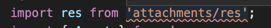

# Troubleshooting

This document will list the common issues that you can run into when using Valdi, hopefully creating a searchable self-service knowledge base over time.

## Common Issues

### Module fails to compile with `TypeScript error: '>' expected`

```
[ERROR] << TypeScript file venue_editor/src/VenueEditor.tsx failed to check: :rotating_light: TypeScript error: '>' expected. at line 79
          /* Let's create a starting point for a typical screen hierarchy */
        }
        <Subscreen>
   :point_right:      <slotted slot='header'>
```

**Make sure your module has at least one .ts file.** If not, you can add an empty one yourself (e.g. an empty `dummy.ts`).

This is a bug in our compilation pipeline, the process that we use to interface with typescript (`tsserver`) seems to not configure itself correctly without having a .ts file in a TypeScript project. A future compiler release will have this fixed.

### Res not found

After loading the valdi_modules workspace & setting the TypeScript version VSCode may not find res files. The image assets are not real-time updated by the hotreloader yet and are only re-uploaded after a full compile. Try `valdi projectsync` or restart of the hotreloader.



### I'm using build from source and made native related changes in the client. How do I see them reflected in IDE (Xcode, Android Studio)?

Native code is generated during the build step and later imported by the IDE. In order to see the newly generated/updated native code, invoke build once.

### Hotreloader not working

#### Android

Make sure your device is connected through USB with a properly working cable. You should be able to see your device using this `adb` command:

```sh
% adb devices
List of devices attached
31171JEHN02897	device
```

Additionally, you should be able to see your device logs using `adb logcat`, and the logs should keep showing in your terminal. If the `adb logcat` randomly interrupts, this might be an indication that the connection between your host machine and your Android device is unstable. If you notice such problems, try using a different USB cable, or try rebooting your host machine and Android device.

#### iOS

Make sure that you don't have multiple applications running Valdi at the same time. There is a known issue with the iOS Simulator running on M1/M2 machines that can cause zombie processes that hold onto the hotreloader socket forever. If this is suspected to be the case, you can try the following steps:

1. `lsof -i :13592` (13592 is the default hotreloader port)
2. If the output is empty then this is likely not the issue.
3. Otherwise, take note of the displayed `PID` the proceed with the next steps.
4. Run `ps -xo pid,ppid,stat,command | awk '$2 == <PID>'` replacing `<PID>` with the actual PID from step 3.
5. Kill those processes with `kill -9 <PID>` or manually with Activity Monitor or its equivalent.

If the above steps do not work - you can try to kill the top level zombie processes (usually just the name of your project) directly via Activity Monitor or command line. Occasionally this will require a system restart.

#### All platforms

##### Delete hotreloader cache

Sometimes hotreloader cache can get stale and cause problems. While this is usually fixed by restarting the hotreloader, in the cases where restarting does not resolve the issue, the last resort solution is to manually delete the cache.

```
rm src/valdi_modules/.valdi_build/hotreload/caches/companion/compilecache.db
```

##### Watchman Configuration

The hotreloader leverages the [Watchman](https://facebook.github.io/watchman/) server to monitor for file changes. Issues with Watchman might cause the hotreloader to fail to start or pick up updated files.

Make sure that you are trying to hotreload a file that is used in a module that is currently displayed in the application (A hotreload banner should show up in the application when it receives new files that triggered a reload of a component).

Make sure that you don't have multiple instances of the hotreloader running at the same time.

Make sure that you are not running the Valdi compiler at the same time as a hotreloader instance is running.

Make sure you are on a recent version of `watchman`

```sh
% watchman --version
2024.07.01.00
```

You can upgrade watchman using `brew upgrade watchman`.

Check that your `watchman` instance is not currently watching directories that might contain a massive amount of files:

```sh
% watchman watch-list
{
    "version": "2023.08.07.00",
    "roots": [
        "/Path/to/my/project",
        "/Path/to/valdi/src/valdi_modules"
    ]
}
```

If you find that `watchman` is observing too many directories or directories that might contain a lot of files like your entire user directory for instance, you can delete a specific watched directory using `watchman watch-del /path/to/dir`. You can also use `watchman watch-del-all` to clear all the entries:

```sh
% watchman watch-del-all
{
    "version": "2023.08.07.00",
    "roots": [
        "/Path/to/my/project",
        "/Path/to/valdi/src/valdi_modules"
    ]
}
% watchman watch-list
{
    "version": "2023.08.07.00",
    "roots": []
}
```

Try restarting the hotreloader after the watch list have been cleared. The hotreloader will re-add the watch list to the `valdi_modules` directory automatically.

## Valdi tooling development issues

### Trying to debug Compiler in Xcode but getting `debugserver is x86_64 binary running in translation`

Make sure Xcode doesn't run under Rosetta
