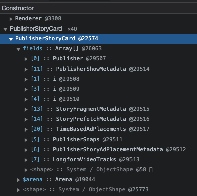
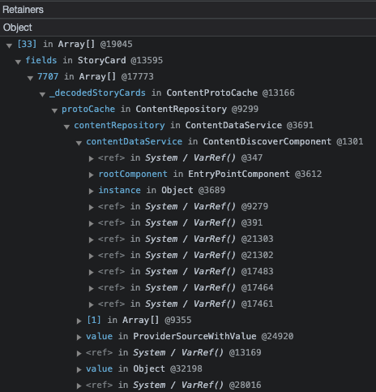

# Debugging Memory Leaks

Valdi supports exporting the heap of the VM in the V8 format, which is supported by the Chrome DevTools and Meta's [Memlab](https://facebook.github.io/memlab/). The heap dump gives a complete report of all of the objects and functions that are currently live within the VM, and the relationships between them.

## Prerequisite

The heap dump is currently only supported with the Hermes engine. See information about [enabling Hermes](../workflow-hermes-debugger.md).

## Requesting a heap dump

The heap dump can be requested by connecting the VSCode debugger to a Valdi application, and requesting a Heap Snapshot. See [VSCode documentation](https://code.visualstudio.com/docs/nodejs/profiling) for more informations about how to collect a heap snapshot.

## Analyzing heap dumps

The `heapsnapshot` file can be opened in the Google Chrome dev tools: navigate to `View` (menu bar at the top) -> `Developer` -> `Developer Tools`.
Next up, you can load the `heapsnapshot` file in `Memory` -> `Load`:

The `Memory` view shows all of the objects that were part of the dump, with their constructor names. On the right side, `shallow size` tells how much memory each object directly consumes, while `retained size` shows how much memory is indirectly consumed by this object through references to other objects.
When expanding an object, the tool shows all of the references that the object is holding. When the reference is gray, like `<shape>` in the example below, the reference is an implicit hidden reference that the VM holds. Other types of references are propertiess or array elements. Only reference types are currently exported in the dump, numbers or booleans will not show up.

At the bottom of the window, the tool shows a `Retainers` section, which contains all of the objects that reference the object selected object. This helps understanding at why the object is currently alive.

Some objects might be retained due to existing references between them and native (C++, Objective-C or Kotlin) code. These references are marked inside an array called `System / ExportedReferences`. When a TypeScript object or function gets exported to native code, the Valdi runtime creates a reference to it with an associated native object. When the associated native object gets deallocated or garbage collected, the exported reference gets torn down.
