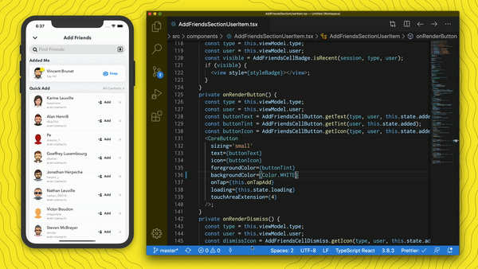

# What is Valdi?

## Build native, cross-platform and performant UIs
Valdi is a framework and view abstraction layer that lets you declaratively express complex views. It strikes a balance between performance and flexibility by optimizing declarative views and allowing for event-based business logic in TypeScript.

Practically speaking, the Valdi Compiler can take TypeScript source files and compile them into .valdimodule files that are read by the Valdi Runtime to render natively. There are no web views.

## Benefits
### Use TypeScript to create views
Valdi uses React-like syntax to create a [tsx](https://www.typescriptlang.org/docs/handbook/jsx.html) view tree, flexbox for layout, and TypeScript for event-handling and business logic.
```tsx
import { Component } from 'valdi_core/src/Component';

class HelloWorld extends Component {
  onRender() {
    const message = 'Hello World! 👻';
    <view backgroundColor='#FFFC00' padding={30}>
      <label color='black' value={message} />
    </view>;
  }
}
```

<p align="center">
  
</p>

### Integrate with native

With Valdi, you can easily integrate with platform native code in many ways.

#### Native views in Valdi

Native views can be embedded in Valdi layouts via the [`custom-view`](./native-customviews.md) tag:

```tsx
import { Component } from 'valdi_core/src/Component';

class HelloWorld extends Component {
  onRender() {
    const myParamPassedToNativeView = 'hello';
    <custom-view
      iosClass="MyNativeView"
      androidClass="com.snap.myfeature.MyNativeView"
      paramForNativeView={myParamPassedToNativeView}
    />
  }
}
```

#### Valdi views in native

Valdi views can be easily embedded in [native view](./native-bindings.md) hierarchies.

```tsx
import { Component } from 'valdi_core/src/Component';

/**
 * @Component
 * @ExportModel({
 *  ios: 'SCValdiHelloWorldView',
 *  android: 'com.snap.hello_world.HelloWorldView'
 * })
 */
class HelloWorld extends Component {

  ...
}
```

```objectivec
// In iOS
#import "valdi/ios/SCValdiRuntimeManager.h"
#import <SCValdiModule/SCValdiHelloWorldView.h>

SCValdiRuntimeManager* runtimeManager = [[SCValdiRuntimeManager alloc] init];
UIView *view = [[SCValdiHelloWorldView alloc]
    initWithViewModel:nil
     componentContext:nil
     runtime:runtimeManager.mainRuntime];
```

```java (works better than kotlin syntax highlighting)
// In Android
import com.snap.valdi.support.SupportValdiRuntimeManager
import com.valdimodule.HelloWorldView

val runtimeManager = SupportValdiRuntimeManager.createWithSupportLibs(this.applicationContext)
val view: View = HelloWorldView.create(
  runtime = runtimeManager.mainRuntime
)
```

### Prototype quickly with hot reload
Valdi lets you iterate quickly with hot-reload on all platforms, including on device. Don't waste time re-compiling to get that view feeling just right and to spec.

<p align="center">
  
</p>

## Advantages over native
* Build cross-platform UI with a single codebase
* Writing views with native technology is a slow, manual, and error-prone process
* UI iteration is generally slow
* Optimizing layout and view inflation is difficult with native APIs

## Valdi design principles
* Valdi should be significantly faster to develop with than traditional native code
* Performance should be equal to, or better than, traditional native code
* Your UI should never crash
* What you see on iOS should be the same as what you see on Android
* It should be possible to build any UI or animation with Valdi
