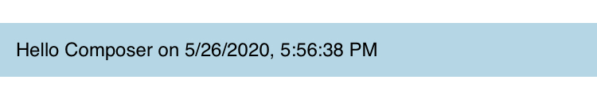
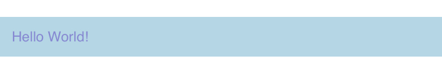
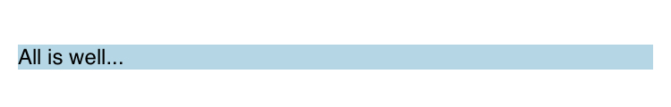
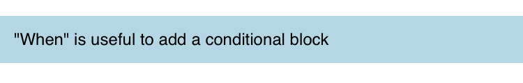
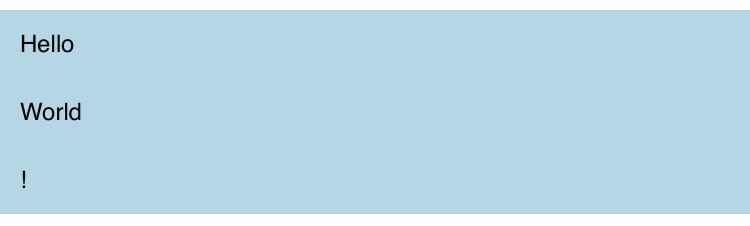
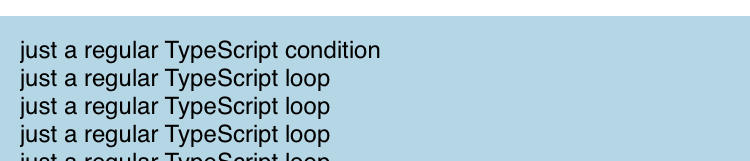
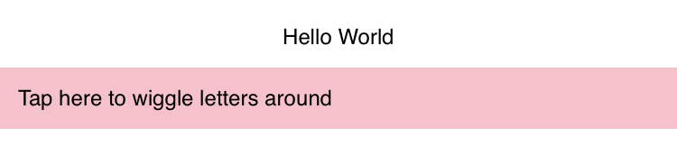
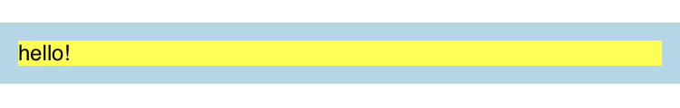
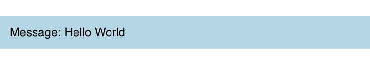

# Introduction

This guide will introduce many of the core concepts of Valdi, and provide you with a high-level
understanding of what development looks like using Valdi. Further guides will dive deeper into the concepts 
shown here.

> [!Note]
> These guides assume an intermediate level knowledge of JavaScript/TypeScript. If this is your first exposure to these
> languages, it might be best to go learn the basics and come back.

## Declarative Rendering

Valdi allows developers to declaratively render data into native UIs using a React-like syntax:

```tsx
import { Component } from 'valdi_core/src/Component';
class HelloWorld extends Component {
  private msg?: string;
  onCreate() {
    this.msg = 'Hello Valdi on ' + new Date().toLocaleString();
  }
  onRender() {
    <view backgroundColor='lightblue' padding={10}>
      <label value={this.msg}/>;
    </view>
  }
}
```



We just created our first Valdi component! 
`onCreate` and `onRender` are Valdi lifecycle events that the Valdi runtime executes to evaluate `this.msg` and then map the value of the `label` on to native views.

## Inline Variables

Besides just text, we can bind variables to element attributes:

```tsx
import { Component } from 'valdi_core/src/Component';
class HelloWorld extends Component {
  private readonly color = '#' + Math.floor(Math.random()*16777215).toString(16);
  onRender() {
    const padding = 5 + 5;
    <view backgroundColor='lightblue' padding={padding}>
      <label color={this.color} value='Hello World!'/>
    </view>
  }
}
```




## Inline Conditionals

It is easy to conditionally render part of the UI based on dynamic variables, as shown here:

Using `if`

```tsx
import { Component } from 'valdi_core/src/Component';
class HelloWorld extends Component {
  onRender() {
    if (false) {
      <label value='This is crazy!' backgroundColor='red' />;
    } else {
      <label value='All is well...' backgroundColor='lightblue' margin={10} />;
    }
  }
}
```



It is also possible to embed conditions inside of xml nodes:

Using `when`

```tsx
import { Component } from 'valdi_core/src/Component';
import { when } from 'valdi_core/src/utils/When';
class HelloWorld extends Component {
  onRender() {
    <view backgroundColor='lightblue' padding={10}>
      {when(42 === 42, () => {
        <label value='"When" is useful to add a conditional block' />;
      })}
    </view>;
  }
}
```



## Inline Loops

Using `array.forEach`

```tsx
class HelloWorld extends Component {
  onRender() {
    const myList = ["Hello", "World", "!"];
    <view backgroundColor='lightblue' padding={10}>
      {myList.forEach(str => {
        <label value={str}/>
      })}
    </view>
  }
}
```


Using `for`

```tsx
class HelloWorld extends Component {
  onRender() {
    const myList = ["Hello", "World", "!"];
    for (const myElement of myList) {
      <view backgroundColor='lightblue' padding={10}>
        <label value={myElement} />
      </view>
    }
  }
}
```




## Nested Render Functions

```tsx
class HelloWorld extends Component {
  onRender() {
    <view backgroundColor='lightblue' padding={10}>
      {this.onRenderContent()}
    </view>;
  }
  onRenderContent() {
    const variable = 'this is a new scope';
    if (variable) {
      <label value='just a regular TypeScript condition' />;
    } else if (!variable) {
    } else {
    }
    for (let i = 0; i < 10; i++) {
      <label value='just a regular TypeScript loop' />;
    }
    while (false) {}
  }
}
```



## Interactive elements

To respond to user input, such as tapping a button, Valdi `<view>` provides callbacks such as `onTap`:

```tsx
import { StatefulComponent } from 'valdi_core/src/Component';
interface HelloWorldState {
  message: string;
}
class HelloWorld extends StatefulComponent<{}, HelloWorldState> {
  state = {
    message: 'Hello World',
  };
  onRender() {
    <label value={this.state.message} textAlign='center' margin={10} />;
    <view onTap={this.onButtonTapped} padding={10} backgroundColor='pink'>
      <label value='Tap here to wiggle letters around' />
    </view>;
  }
  onButtonTapped = () => {
    this.setState({
      message: this.state.message
        .split('')
        .reverse()
        .join(''),
    });
  };
}
```



Note that this introduces the concept of Component [state](./core-states.md), as defined by `interface HelloWorldState`.  As opposed to our other examples, we 
want the UI to respond to changes to our message variable.  In order to do this, we move our `message` variable into the
component state, and any changes to the state, as shown by called `this.setState`, will automatically update the UI.
Notice that we access the value of the variable using `this.state.message` within the onRender function.

## Composing Components

It is good practice to build small components with a single focus for both re-use and ease of development. We encourage you to build small components that can be combined together to create your UI. Valdi makes
it easy to embed components within components:
```tsx
import { Component } from 'valdi_core/src/Component';
class MyOtherComponent extends Component {
  onRender() {
    <view backgroundColor='yellow'>
      <label value='hello!' />;
    </view>;
  }
}
class HelloWorld extends Component {
  onRender() {
    <view backgroundColor='lightblue' padding={10}>
      <MyOtherComponent />
    </view>;
  }
}
```



The parent can pass data down to the child through the child's `ViewModel`:

```tsx
interface MyOtherComponentViewModel {
  message: string;
}
class MyOtherComponent extends Component<MyOtherComponentViewModel> {
  onRender() {
    <label value={'Message: ' + this.viewModel.message} />;
  }
}
class HelloWorld extends Component {
  onRender() {
    <view backgroundColor='lightblue' padding={10}>
      <MyOtherComponent message='Hello World' />;
    </view>;
  }
}
```



In this example, we define `message` to be part of the `interface MyOtherComponentViewModel` of the `<MyOtherComponent>` component. Notice
that we access the value of the variable using `viewModel.message` within the template.

Then we use `message='Hello World'` to pass the value of `message` from the parent component down to the child.
