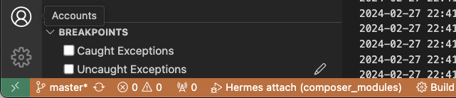
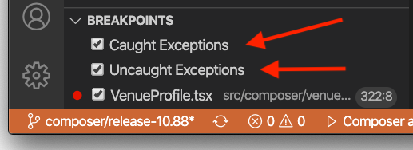

# Hermes Debugger

Valdi supports a new debugging environment to provide developers working with Valdi a stable, reliable and consistent debugging experience that can be used across the different platforms that Valdi supports. Live debugging within VSCode should be enabled, as long as Hermes is enabled, your application is running in debug mode and the hot reloader is running.

The debugger supports:
- Inspect and modify variables
- Single Step / Step In / Step Out
- Set Breakpoints
- Pause on Exceptions
- View current call stack
- Debug JS Worker Threads
- Debug console to Run commands in a paused JS Context

## Enabling Hermes

The Hermes engine integration is compiled in on debug builds for iOS and Android, and on all build types for macOS. Projects generated through `valdi bootstrap` will use Hermes by default whenever available. For other projects, you can set `build --valdi_js_engine=hermes` in the `.bazelrc` file.

## Attaching the Debugger

When the hot reloader is connected to an instance of the app, you are now able to attach a debugging session to the app right within VSCode. Select "Valdi attach" configuration and click the green triangle, or press F5:

The `Valdi attach` option is configured automatically after running `valdi projectsync`.

The bottom status bar in VSCode will turn orange-ish when the debugger is attached successfully:

Please note that the hot reloader needs to be started for the debugger to work.

## Breakpoints

Once attached, you can add breakpoints in the editor gutter:

VSCode will show that the breakpoint was successfully set by displaying a filled red dot on the left side of the editor.

When execution is paused on a breakpoint you should be able to inspect the state of any expressions available in the current scope by mousing over them:

For breakpoints to work properly, the VSCode debugger needs a source mapping information that gets generated through `valdi projectsync`. You will need to re-run `valdi projectsync` when new modules are added so that the debugger is able to map the files on disk to the files that run within the engine on the device.

## Debug Console

When execution is paused on a breakpoint, you use the Debug Console to evaluate JS expressions and statements directly:

## Pause on Exceptions

You can also tell the runtime to pause execution on caught and uncaught errors by toggling the checkboxes in the bottom left corner:

This is what that would look like once an exception is caught:

## Profiling and memory heap dumps

You can gather profiling data and memory heap dumps when the Hermes engine is enabled. See [VSCode documentation](https://code.visualstudio.com/docs/nodejs/profiling) for more information about how to use these features.

## Troubleshooting

Here are some things you can try if your breakpoints aren't working or you are not able to attach:
- Make sure that the Valdi hot reloader is running, is connected to your device, and is configured to hot reload targets that you are trying to debug.
- Run `valdi projectsync` to get an updated `.vscode/launch.json` file, which contains the Valdi attach information necessary for the VSCode JS debugger.
- Make sure that the Hermes engine is enabled. You should have `build --valdi_js_engine=hermes` in the `.bazelrc` file. You can only use the debugger on debug builds.